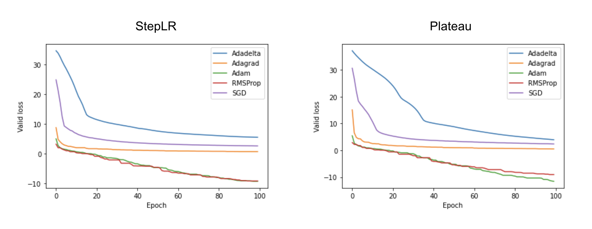
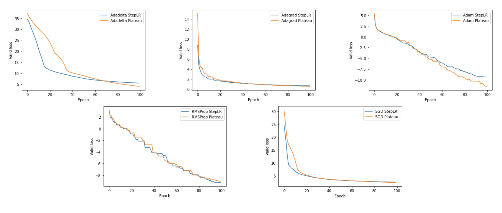
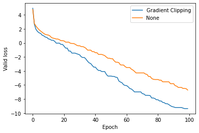

# 9143-HPML-Project

- Project title: Voice Separation and Optimization in Recurrent Neural Networks
- Team members: Leo Hu, Junda Ai

## Introduction

In this project we looked into two state-of-the-art voice separation model implementations, and anaylzed the effects of different optimization algorithms and techniques on them.

## Getting started

[SVoice experiment](https://colab.research.google.com/drive/1B1cNeMLSL0KVs-Am1dKA5_F4E6k474_d#scrollTo=9DPpT3KiFTn2) was carried out on Google Colab.

## Experiment results

SVoice:

- Adam yields the best results among gradient descent optimizers
- Plateau learning rate (decay when a metric stops improving) scheduler with Adam works better than StepLR (step-wise decay)
- Gradient clipping further improves performance

Gradient descent optimizers:

LR schedulers:

Gradient clipping:

