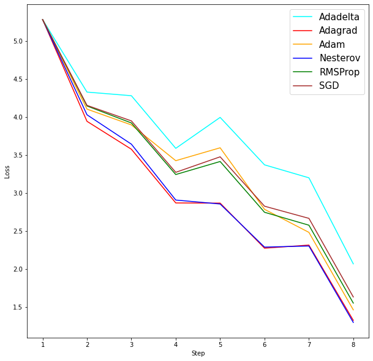

# 9143-HPML-Project

- Project title: Voice Separation and Optimization in Recurrent Neural Networks
- Team members: Leo Hu, Junda Ai

## Introduction

In this project we looked into two state-of-the-art voice separation model implementations, and anaylzed the effects of different optimization algorithms and techniques on them.

## Spleeter

An optimizer modification of [Spleeter by deezer](https://github.com/deezer/spleeter/)

### Installation

Environment

```
# Install media/file dependencies using conda
conda install -c conda-forge ffmpeg libsndfile
# Clone spleeter repository
git clone https://github.com/Deezer/spleeter && cd spleeter
# Install poetry
pip install poetry
# Install spleeter dependencies
poetry install
# Run unit test suite
poetry run pytest tests/
```

To enable GPU

```
# Uninstall CPU tensorflow
pip uninstall tensorflow
# Install GPU tensorflow
pip install tensorflow-gpu==2.5.0
```

Modification

```
# Replace spleeter/model/__init__.py with __init__.py in spleeter_mod
# Replace spleeter/__main__.py with __main__.py in spleeter_mod
# Place spleeter_entry.py in base directory

Modification Base/
├─ spleeter (forked)/
│  ├─ model/
│  │  ├─ __init__.py (modified)
│  ├─ __main__.py (modified)
├─ spleeter_entry.py
```

Preparation

```
# prepare the dataset: MUSDB18-HQ is used
# prepare the csv: based on dataset used
# modify the config: modify the links in the config file
```

### Training

- To test different optimizers, modify the `optimizer` item in the config file
- Logging frequency can be specified in `__main__.py`

when everything is ready:

```
python spleeter_entry.py train -p path/to/spleeter_config.json -d path/to/datasets --verbose
```

### Result

Results for different optimizers are saved in [spleeter-results](spleeter-results) directory. `spleeter_parse_data.ipynb` provides data parsing functions and graphing functions for data parsing and visualization.

Training Loss of first 8 steps using different optimizers:



More graphs can be found in the [img](img) directory.

---

## SVoice

[SVoice: Speaker Voice Separation using Neural Nets](https://github.com/facebookresearch/svoice)

- [Hydra](https://hydra.cc/) to manage training configurations
- Custom implementation of [SI-SNR](https://arxiv.org/abs/1711.00541) loss function
- Adam optimizer
- Gradient clipping

### Getting started

[SVoice experiment](https://colab.research.google.com/drive/1B1cNeMLSL0KVs-Am1dKA5_F4E6k474_d#scrollTo=9DPpT3KiFTn2) was carried out on Google Colab.

Jupyter notebooks for ploting validation results:

- [svoice_grad_clip](svoice_grad_clip.ipynb)
- [svoice_lr_schl](svoice_lr_schl.ipynb)
- [svoice_optim](svoice_optim.ipynb)

### Results

Please find all the training outputs in [svoice-results](Alan052918/9143-HPML-Project/tree/main/svoice-results)

- Adam yields the best results among gradient descent optimizers
- Plateau learning rate (decay when a metric stops improving) scheduler with Adam works better than StepLR (step-wise decay)
- Gradient clipping further improves performance

Gradient descent optimizers:


LR schedulers:


Gradient clipping:


